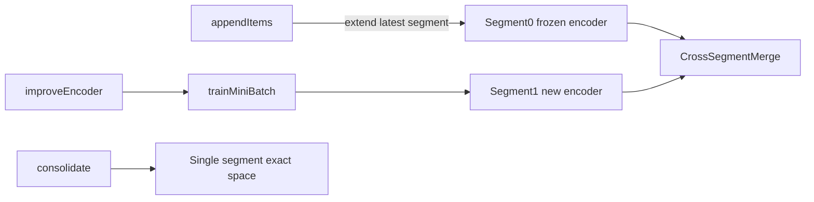

# Incremental Index Updates

Design notes for the segmented incremental update mechanism used by text benchmark artifacts in biohash.

---

## Summary

Text benchmark indexes are persisted as **ordered segments**. Each segment binds a frozen encoder snapshot to the corpus ids and sparse hashes it produced. Three operations extend the index without always re-hashing the full corpus:

1. **Append** — add new documents under the latest frozen encoder (cheap, exact within the segment).
2. **Improve encoder** — mini-batch train BioHash weights on new data, then store new documents in a new segment with the updated encoder.
3. **Consolidate** — re-encode every indexed document with the newest encoder into a single segment, restoring one globally consistent hash space.

The layout is intentionally LSM-like: most updates append in place; encoder changes create new segments; consolidation compacts back to one segment when needed.

---

## Problem and Motivation

### Why hash codes are not portable

BioHash maps each input vector to a sparse binary code via learned weights `W` and k-Winner-Take-All (k-WTA) selection. A stored `SparseHash` is only meaningful relative to the **specific weight matrix** that scored the input and selected the active bits. If `W` changes, old codes were produced under a different projection; comparing them to queries encoded with a newer `W` is inconsistent.

See [biohash-ryali20a.md](./biohash-ryali20a.md) for the underlying algorithm.

### Two goals that are often conflated

| Goal | What you need | Typical trigger |
|------|---------------|-----------------|
| **Incremental indexing** | Add new documents without touching old hashes | Corpus growth, same embedding model and distribution |
| **Online learning** | Update `W` from new data | Distribution drift, domain shift |

These require different machinery:

- **Incremental indexing alone** does not require changing `W`. Encode new vectors with the existing encoder and append.
- **Online learning** changes `W`, which invalidates old hashes unless you re-encode old items or keep separate hash spaces per encoder snapshot.

### What we avoid

| Approach | Problem |
|----------|---------|
| Re-hash entire corpus on every update | `O(N·m·d)` encode cost; unacceptable for large N |
| Query all items with latest encoder only | Old hashes become stale; retrieval quality degrades |
| Permanent multi-encoder merge with no compaction | Query cost and storage grow without bound; cross-space Hamming ranks are biased |

### Design intent

- **Default path**: frozen-encoder append — one consistent hash space, exact Hamming retrieval, minimal format change.
- **Optional path**: encoder improvement via new segments — old items stay un-re-hashed; new items use updated weights.
- **Escape hatch**: consolidation — bounded segment count, restore a single exact hash space when cross-segment approximation is no longer acceptable.

---

## Core Concepts

### Segment

A **segment** is a triple:

```
(encoder snapshot, corpus ids, corpus hashes)
```

plus metadata: `segmentId`, `itemCount`, `trainingSteps`, `createdAt`, and on-disk file paths.

Segments are **ordered**. Segment 0 is created by initial training; later segments are appended when the encoder is improved. Queries and consolidation treat the **latest** segment as the current encoder snapshot.

### Hash-space consistency

| Scope | Consistency |
|-------|-------------|
| Within one segment | **Exact** — query and corpus hashes share the same encoder |
| Across segments (multi-segment query) | **Approximate** — Hamming distances from different encoders are merged heuristically |
| After consolidation | **Exact** — single segment, single encoder |

---

## Architecture Overview



**Typical lifecycle**

1. Initial `trainTextBenchmark` writes segment 0 (legacy file layout).
2. New documents arrive → `appendItems` extends segment 0 (no new encoder file).
3. Optional drift handling → `improveEncoder` creates segment 1 with updated weights and new items only.
4. Queries scan all segments and merge top candidates.
5. When segment count or cross-segment bias becomes a problem → `consolidate` re-encodes everything into one segment.

---

## Operations

### Append (`appendItems`)

**Intent**: Grow the index cheaply when the embedding distribution is stable and the learned encoder does not need to change.

**API**: `TextBenchmarkRunner.appendItems(artifactDir, newIds, newVectors)`

**Steps**

1. Load artifact; take `latestSegment.encoder` (frozen).
2. Encode `newVectors` with that encoder.
3. Call `TextIndexArtifact.extendLatestSegment` — append ids/hashes to the latest segment's files; update manifest `corpusSize`.

**Properties**

- Old ids and hashes are unchanged (only the segment's id/hash files grow).
- No new encoder snapshot is written on the append-only path.
- Retrieval within the extended segment remains exact.
- Supported for **BioHash**, **NaiveBioHash**, and **FlyHash**.

**Cost**: `O(B·m·d)` encode for batch size `B`, hash layer width `m`, input dimension `d`.

**When to use**: Same-distribution document additions; default for routine corpus updates.

---

### Improve encoder (`improveEncoder`)

**Intent**: Adapt `W` to new data without re-hashing the existing corpus.

**API**: `TextBenchmarkRunner.improveEncoder(artifactDir, newIds, newVectors, updateConfig?)`

**Steps**

1. Load latest segment encoder weights.
2. Restore a trainable `BioHash` (or `NaiveBioHash` via inner BioHash) with `BioHash.fromWeights`.
3. Run `trainMiniBatch` on `newVectors` with optional `IncrementalUpdateConfig` (`epochs`, `learningRate`).
4. Encode new items with the updated encoder.
5. Call `TextIndexArtifact.appendSegment` — write new encoder file, new id/hash shard, update `segments.properties`.

**Properties**

- Existing segments are untouched (no re-hash of old items).
- Creates a **new segment** with its own encoder snapshot.
- **FlyHash is rejected** (no training step).
- Cross-segment queries become approximate until consolidation.

**Cost**: `O(E·B·m·d)` training for `E` epochs plus `O(B·m·d)` encode, plus `O(m·d)` encoder storage per new segment.

**When to use**: Measured or expected distribution drift; periodic adaptation with conservative learning rates. Prefer larger mini-batches and fewer segments over many tiny updates.

---

### Consolidate (`consolidate`)

**Intent**: Collapse a multi-segment index back to one encoder and one hash space with exact global ranking.

**API**: `TextBenchmarkRunner.consolidate(artifactDir, vectorsById)`

**Steps**

1. Load artifact; take `latestSegment.encoder`.
2. Collect all corpus ids in segment order; look up dense vectors from `vectorsById`.
3. Re-encode all vectors with the latest encoder.
4. Call `TextIndexArtifact.replaceWithSingleSegment` — rewrite legacy segment-0 files, delete extra segment files and `segments.properties`.

**Properties**

- Requires **dense vectors keyed by corpus id** — the artifact stores hashes, not original embeddings.
- No additional training; encode-only pass.
- **FlyHash consolidation is not supported** in the current implementation.
- After consolidation, `segmentCount == 1` and queries use the fast single-segment path.

**Cost**: `O(N·m·d)` encode for full corpus size `N`.

**When to use**: Segment count has grown; cross-segment merge bias is unacceptable; you need a single exact hash space for production or benchmarking.

---

## Training and Determinism

### `trainMiniBatch`

`BioHash.trainMiniBatch` loops `trainStep` over a batch for a configurable number of epochs, with optional shuffling. Full-corpus `train()` delegates to the same internal `runTrainingPasses` helper so behavior stays aligned.

```scala
def trainMiniBatch(
    batch: IndexedSeq[Array[Double]],
    epochs: Int = 1,
    shuffle: Boolean = true,
    shuffleSeedOffset: Long = trainingSteps
): Unit
```

### Shuffle seeding after reload

Restoring an encoder via `BioHash.fromWeights` creates a **new** RNG instance seeded from `config.seed`. The shuffle order does **not** continue from where a previous in-memory session left off.

For reproducible mini-batch updates across reloads, shuffles when `shuffle = true` use:

```
Random(config.seed + shuffleSeedOffset + epoch)
```

Pass the persisted `trainingSteps` (from manifest or segment metadata) as `shuffleSeedOffset` when calling `trainMiniBatch` after reload. The artifact stores:

- `totalTrainingSteps` in `manifest.properties`
- `trainingSteps` per segment in `segments.properties`

### `currentTrainingSteps`

Each `trainStep` increments an internal counter exposed as `currentTrainingSteps`. Initial training records this in the manifest; `improveEncoder` persists the post-update count on the new segment.

---

## On-Disk Artifact Format

### Legacy layout (segment 0 only)

When `segments.properties` is absent, the loader treats the artifact as a single segment 0:

| File | Contents |
|------|----------|
| `manifest.properties` | Dataset, method, hyperparameters, `corpusSize`, `segmentCount`, `totalTrainingSteps`, … |
| `encoder.bin` | Method tag + weight matrix |
| `corpus.hashes.bin` | Sparse hash codes |
| `corpus.ids` | One corpus id per line |

Existing artifacts from before incremental support load unchanged.

### Multi-segment layout

After `appendSegment`, `segments.properties` lists ordered segments:

```
segmentCount=2
segment.0.id=0
segment.0.encoderFile=encoder.bin
segment.0.hashesFile=corpus.hashes.bin
segment.0.idsFile=corpus.ids
segment.0.itemCount=1000
segment.0.trainingSteps=5000
segment.0.createdAt=...
segment.1.id=1
segment.1.encoderFile=encoder-1.bin
segment.1.hashesFile=corpus-1.hashes.bin
segment.1.idsFile=corpus-1.ids
...
```

Segment 0 always uses legacy filenames. Segment `N > 0` uses:

- `encoder-N.bin`
- `corpus-N.hashes.bin`
- `corpus-N.ids`

### Manifest fields (incremental)

| Field | Default (legacy) | Meaning |
|-------|------------------|---------|
| `segmentCount` | `1` | Number of segments |
| `totalTrainingSteps` | `0` | Cumulative `trainStep` count for latest BioHash training state |

### Backward compatibility

- Missing `segments.properties` → single segment 0 from legacy files.
- Missing `segmentCount` / `totalTrainingSteps` in manifest → defaults above.

---

## Query Semantics

### Single segment (`segmentCount == 1`)

Standard path:

1. Encode all queries with the segment encoder.
2. `Retrieval.retrieveTopR` over that segment's hash block.
3. Map local indices to corpus ids.

Hamming ranking is **exact** within the index.

### Multi-segment (`segmentCount > 1`)

Implemented in `SegmentedRetrieval`:

1. For each query vector, encode once **per segment** with that segment's encoder.
2. Run `Retrieval.retrieveTopR` within each segment's hash block.
3. Collect candidates as `(segmentId, corpusId, distance)`.
4. Merge globally; take top `R`.

**Tie-break order** (deterministic):

1. Hamming distance (lower is better)
2. `segmentId` (lower first)
3. `corpusId` (lexicographic)

When `normalizeCrossSegmentDistances = true` on `TextBenchmarkRunner.query`, each segment's distances are min-max normalized to `[0, 1]` before merge (per-segment, over that segment's candidate set). Default is **off**. Normalization may reduce cross-space bias but does not make ranks strictly comparable; consolidation remains the path to exact global ordering.

### When to consolidate for query quality

Consolidate when:

- You need a single comparable ranking across the full corpus.
- Segment count has grown and query latency (`O(S·m·d)` encode + `S` scans) is too high.
- Encoder improvements have accumulated and cross-segment Hamming merge is skewing results.

---

## Complexity and Storage

| Operation | Time | Extra storage |
|-----------|------|---------------|
| Append | `O(B·m·d)` encode | `O(B·k)` hashes + ids only |
| Improve encoder | `O(E·B·m·d)` train + `O(B·m·d)` encode | `O(m·d)` encoder snapshot + new shard |
| Query (S segments) | `O(S·m·d)` encode + S index scans | — |
| Consolidate | `O(N·m·d)` encode | Rewrites to single segment; deletes extra segment files |

Symbols: `B` = batch size, `N` = total corpus, `m` = hash layer width, `d` = input dimension, `k` = hash length, `S` = segment count, `E` = training epochs.

Encoder snapshot size is `O(m·d)` doubles per segment. Frequent small `improveEncoder` calls can make snapshots dominate artifact size; prefer larger batches and occasional consolidation.

---

## Tradeoffs and Anti-Patterns

### Append-only (recommended default)

**Pros**: Exact retrieval, minimal I/O, no segment proliferation, backward-compatible layout.

**Cons**: Encoder fixed; no adaptation to drift.

### Improve on every small batch

**Pros**: Fresher weights for new data.

**Cons**: Unbounded segments; growing query cost; biased cross-segment merge; extra encoder storage. Mitigate with larger mini-batches, lower learning rates, and periodic consolidation.

### Never consolidate

**Pros**: Never pay `O(N·m·d)` re-encode.

**Cons**: Permanent approximate multi-space queries; latency scales with segment count.

### Query old hashes with latest encoder only

**Pros**: Simple single encoder at query time.

**Cons**: Stale codes; retrieval degrades as weights drift. Not supported by this design.

### Consolidation without dense vectors

The artifact does not store original embeddings. Consolidation requires an external source (e.g. reload from `TextBenchmarkDataset.corpusVectors` keyed by id). Plan for vector availability before relying on consolidation in production.

### Method support summary

| Method | Append | Improve | Consolidate |
|--------|--------|---------|-------------|
| BioHash | Yes | Yes | Yes |
| NaiveBioHash | Yes | Yes (via inner BioHash) | Yes |
| FlyHash | Yes | No | No |

---

## API Reference

### Orchestration (`TextBenchmarkRunner`)

| Method | Purpose |
|--------|---------|
| `train(...)` | Initial index build; writes segment 0 |
| `appendItems(artifactDir, newIds, newVectors)` | Frozen-encoder append |
| `improveEncoder(artifactDir, newIds, newVectors, updateConfig?)` | Train + new segment |
| `consolidate(artifactDir, vectorsById)` | Single-segment rebuild |
| `query(..., normalizeCrossSegmentDistances = false)` | Evaluation / retrieval metrics |

### Artifact persistence (`TextIndexArtifact`)

| Method | Purpose |
|--------|---------|
| `load(dir)` | Load all segments (legacy or multi-segment) |
| `extendLatestSegment(dir, newIds, newHashes)` | Append to latest shard |
| `appendSegment(dir, encoder, newIds, newHashes, trainingSteps)` | Add new segment |
| `replaceWithSingleSegment(dir, encoder, ids, hashes, trainingSteps)` | Consolidation write |

### Cross-segment retrieval (`SegmentedRetrieval`)

| Method | Purpose |
|--------|---------|
| `retrieveTopR(queryVector, segments, r, normalizeCrossSegmentDistances)` | Top-R corpus ids across segments |
| `mergeCandidates(candidates, r)` | Deterministic global merge |

### Training (`BioHash`)

| Method | Purpose |
|--------|---------|
| `trainMiniBatch(batch, epochs, shuffle, shuffleSeedOffset)` | Online update on new data |
| `fromWeights(config, weights, trainingSteps)` | Restore encoder for improve/consolidate |
| `currentTrainingSteps` | Persisted step counter |

---

## Tests

| Suite | Coverage |
|-------|----------|
| `BioHashSuite` | `trainMiniBatch` weight changes, normalization, equivalence to repeated `trainStep` |
| `TextIndexArtifactSuite` | Legacy load, extend, append segment, consolidate, deterministic multi-segment merge |
| `TextBenchmarkSuite` | End-to-end append, improve, consolidate on fixture dataset |

Run: `scala-cli test .`

---

## Related Documentation

- [biohash-ryali20a.md](./biohash-ryali20a.md) — BioHash algorithm, notation, and hyperparameters
- [scoring-backend-report.md](./scoring-backend-report.md) — Numeric backend performance for encode/score paths
- [README.md](../README.md) — Build, run, and text benchmark CLI entry points
